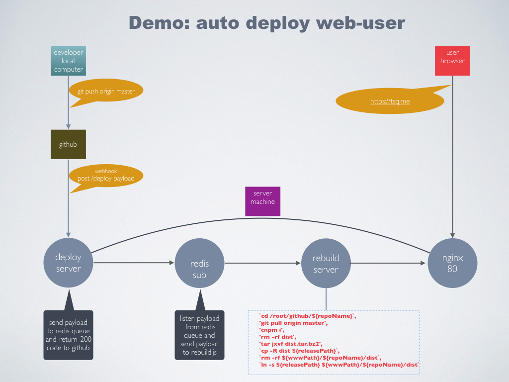

# deploy-server
Make the deployment more quickly.


### Files

```
deploy-server
    |-- app.js          # entry js
    |-- log.js          # push message to wechat
    |-- rebuild.js      # deployment script
    |-- sub.js          # redis subscribe
```

### Process diagram

